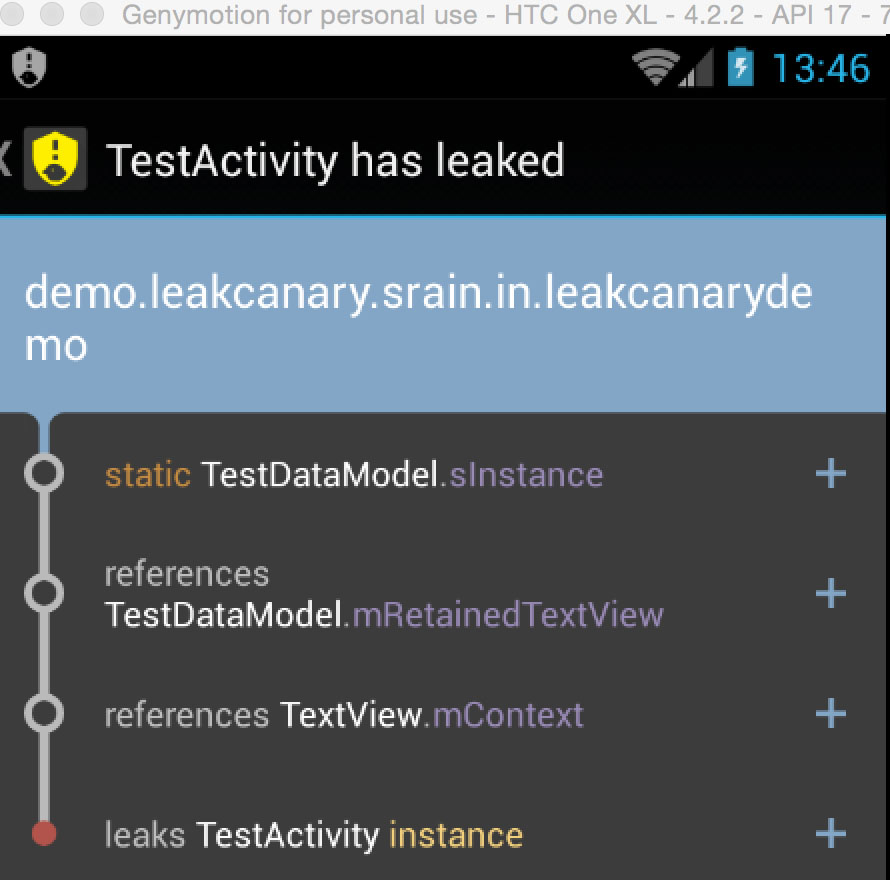
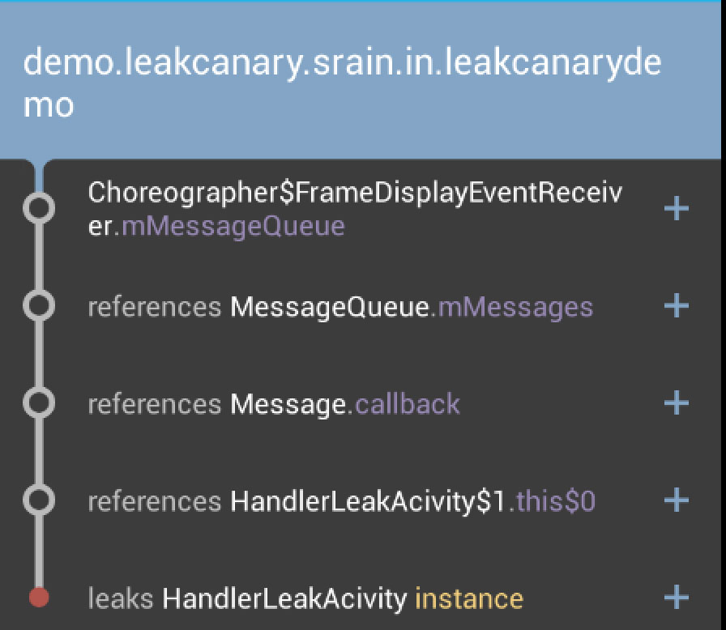

> 很给力的分析工具，基本上能够解决内存泄露的大部分场景，比MAT看起来清晰。

## 常见的内存泄露的几种场景 

1. 数据库中的`Cursor`没有关闭;
2. 广播接收器没有销毁;
3. IO 操作没有进行关闭
4. Bitmap没有销毁
5. context 泄露
6. Handler 泄露
7. 线程泄露
8. Adapter 每次都直接 new View 返回。

## LeakCanary 使用：
> 首先贴下 github的地址： [https://github.com/square/leakcanary](https://github.com/square/leakcanary)使用方法参考README.md文件。

有网络的情况下使用就很方便了。like this

```java
 dependencies {
   debugCompile 'com.squareup.leakcanary:leakcanary-android:1.3.1' // or 1.4-beta1
   releaseCompile 'com.squareup.leakcanary:leakcanary-android-no-op:1.3.1' // or 1.4-beta1
   testCompile 'com.squareup.leakcanary:leakcanary-android-no-op:1.3.1' // or 1.4-beta1
 }
```

`debugCompile` 表示只会在debug模式下才会去使用这个依赖，`releaseCompile` 表示只在发布正式版本的时候区使用这个依赖。这种模式非常方便我们在发布不同的包可以不用修改代码而取消到某些功能。
没有网络的开发环境就很辛苦了需要自己下载jar。这里我打包了leakcanary-jar-1.3的包，包括haha 包。[下载](https://github.com/pengqinping/leakcanary-demo/blob/master/download/leakcanary-jar.zip)

下载之后通过 import library project with jar/aar 即可。

#### leak Canary 案例分析 demo直接使用[liaohuqiu](https://github.com/liaohuqiu/leakcanary-demo)的demo,

1. 静态持有 activity fragment 等生命周期短的 视图控件

`TestActivity.java`

```java
@Override
    protected void onCreate(Bundle savedInstanceState) {
        super.onCreate(savedInstanceState);
        setContentView(R.layout.activity_test);
        TextView textView = (TextView) findViewById(R.id.test_text_view);
        TestDataModel.getInstance().setRetainedTextView(textView);
    }
```

`TestDataModel`

```java
 private static TestDataModel sInstance;
    private TextView mRetainedTextView;
    public static TestDataModel getInstance() {
        if (sInstance == null) {
            sInstance = new TestDataModel();
        }
        return sInstance;
    }
    public void setRetainedTextView(TextView textView) {
        mRetainedTextView = textView;
    }
```

这样就会有一个泄露，TestDataModel的单例对象会持有TestActivity 的 textView对象的引用，如果这个单例无法销毁就会有内存泄露，这个使用只需要进入 TestActivity后在退出leakcanary 就会检测到内存泄露。并且有相关的描述




2.handler 发送消息在activity destory的时候没有停止，导致activity不能被释放，

`HandlerLeakAcivity.java`

```java
 protected void onCreate(Bundle savedInstanceState) {
        super.onCreate(savedInstanceState);
        setContentView(R.layout.activity_handler_leak);
        mHandler.postDelayed(loopRunable, 4000l);
    }

    private Handler mHandler = new Handler();

    private Runnable loopRunable = new Runnable() {
        @Override
        public void run() {
            Log.d("lll", "loopRunnable is Running");
            mHandler.postDelayed(this, 3000L);
        }
    };
```


<small class="img-hint">赶紧为你的项目添加 leakcanary 检测下是否有内存泄露吧 </small>

